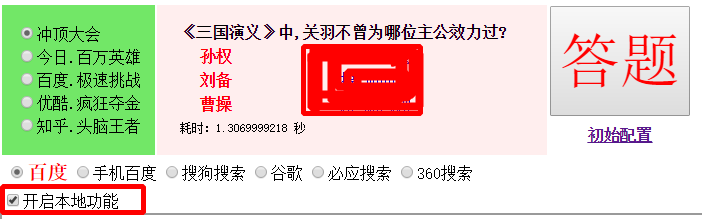

# 直播答题小能手之本地版

**申明**

<font color="red"><b>本项目是作者业余开发，仅为娱乐和研究的目的，如有任何人凭此做何非法事情，均于作者无关。请勿用于商业用途。</b></font>

软件是[直播答题小能手](https://github.com/anhkgg/answerot)的副手，用于本地拉取题目信息。

可以做到只用部署一个`直播答题小能手`服务端，在任何电脑上运行answerotx之后，访问答题小能手地址即可完成题目搜索。

# 更新

1. **发布v0.1.3**。压缩包下载请点击[v0.1.3](https://github.com/anhkgg/answerotx/releases/tag/v0.1.3)。

# 使用

1. 通过USB连接手机到电脑端，开启手机USB调试模式（某些手机需要手工确认允许）。

2. 运行answerotx.bat，根据提示输入手机设备号，如下的`194f41e1`。如果没有设备信息，请检查手机是否连接成功，USB调试模式是否正确启用。

```
请仔细查看下面的提示信息：

-----------------------示例设备信息------------------------------
List of devices attached
56939233 device        (若监控手机设备，下面输入56932933)
emulator-4444 host     (若监控该虚拟机，下面输入emulator-4444)

-----------------------实际设备信息-------------------------------
List of devices attached
* daemon not running. starting it now on port 5037 *
* daemon started successfully *
194f41e1        device

输入要控制的设备号\>194f41e1
AnswerotX: Start monitor < 194f41e1 >
AnswerotX: start...
```

3. 访问`直播答题小能手`的服务器地址，如`http://地址:端口/index/`，然后再界面中勾选`开启本地功能`复选框，点击答题即可。



**注意：**

**使用本软件之后，`直播答题小能手`初始配置时不用配置设备号和分辨率。**

如果觉得自己部署`直播答题小能手`麻烦，也可以使用我提供的服务器地址：

**[http://answerot.com/index/](http://answerot.com/index/)**

# 捐助

如果觉得本软件对你有帮助，可以给作者发点小红包表示鼓励，毕竟作者搭建服务器也是有花费的，感谢。


